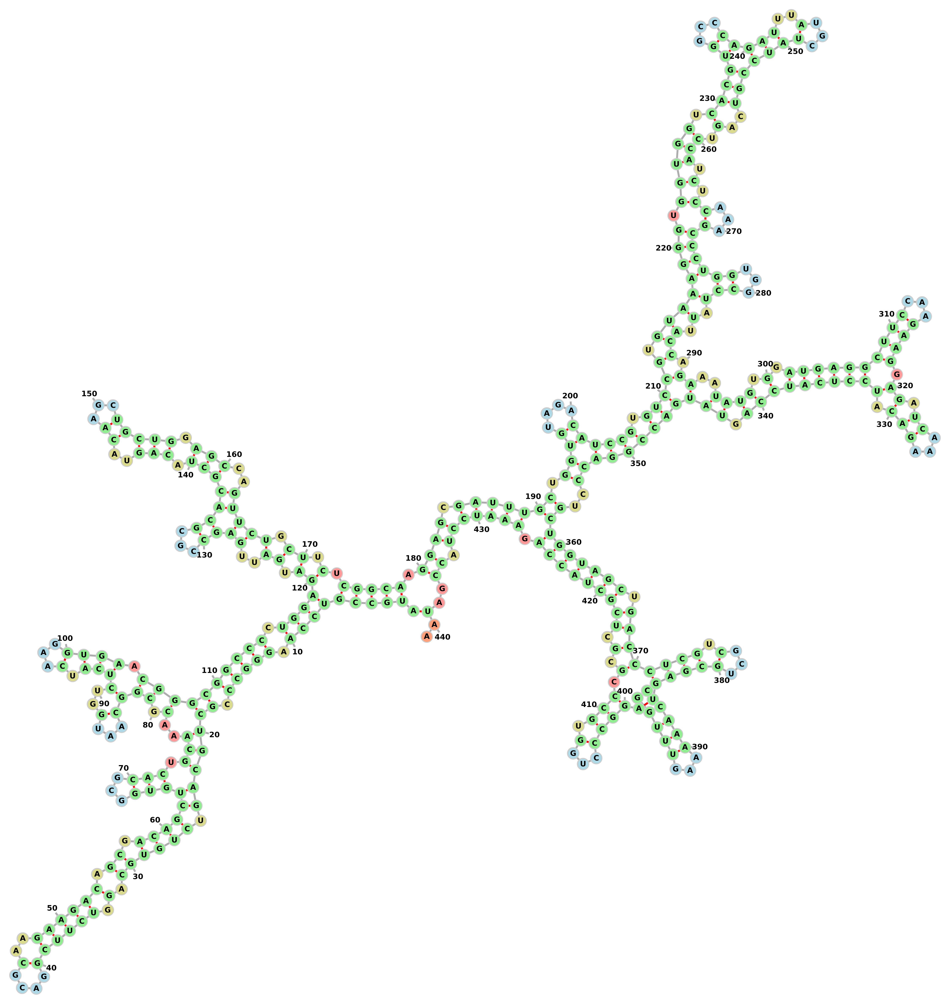

# Tools For Computational Biology

Here are two useful tools that can be used in computational biology. The first one can be used for determination of population of an individual from the SNPs in [VCF](https://en.wikipedia.org/wiki/Variant_Call_Format) files. And the other one can be used to predict the structure of a RNA-sequence.


## Get Distance Matrix From VCF Files

Sequencing the genes of an individual by a [sequencer machine](https://en.wikipedia.org/wiki/DNA_sequencer), which is available in most biological labs, the machine usually will generate sequences in FASTQ-format, those sequences can be mapped later against a large reference genome using some tools like [BWA](http://bio-bwa.sourceforge.net/bwa.shtml), that usually generates its output in **sam-Format** files, which can be converted to **bam-Format** using other tools like [SAMTOOLS](http://www.htslib.org/doc/). Having a Homo-sapiens-assembly as a reference, the SNPs (single nucleotide polymorphisms) can be called using [GATK](https://software.broadinstitute.org/gatk/documentation/tooldocs/current/org_broadinstitute_hellbender_tools_walkers_haplotypecaller_HaplotypeCaller.php), then you can compare the SNPs in the generated VCF-file with SNPs of other individuals, those who are known to which population they belong "like some sample from [1000 Genomes Project](https://www.internationalgenome.org) ", by calculating a distance matrix between all of them, and them plot a PCA of the calculated distance matrix to get an idea about to which population your individual belongs.

To install the tool all you need is a C++ compiler. To build it do the following:

- [x] in your terminal navigate to the **distMat** folder, then choose one of the versions **debug** or **release**.

- [x] from there write the following command `cmake .` "**_do not forget the blank space between `cmake` and `.`_**", if an appropriate C++ compiler on your system was found, a `make` file will be generated to build the tool.

- [x] if the previous step went without errors, go ahead and write `make`
- [x] after the building process was successfully completed, you will find a binary file called **distMat** in the same directory, which you could use to calculate a distance matrix from VCF files.


The tool **distMat** calculates a distance matrix between a sample in the first VCF file and other samples in the second VCF file. The tool considers only the SNPs on the chromosome 1 "**chr1**", which is enough to determine the population.

To run, it takes 5 arguments, and they are as follow:

* the firs argument is a VCF file contains the SNPs of only one sample, if the file contains SNPs of more than one sample, the SNPs of the first sample will be read, and the rest will be ignored 
* the second argument is a VCF file contains the SNPs of other samples, the number of samples in this file is unlimited 
* the third argument is a penalty-function file. we give this as an option, so we can apply weighted distance-penalties, e.g there is a distance between 1|1 and 0|1 , and also a distance between 1|1 and 0|0 , but the two distances are not equal, so instead of penalizing the two distance by the same value, we can give each distance a different penalty value. This can be defined as desired from the last column in the penalty-function file.  An example of how a penalty-function file should look like, can be found in folder **distMat**, called **pen**. If you're still not sure how to define your own penalty-function file, just go ahead and use the one provided in the **distMat** folder.
* the fourth argument is the output file.
* the fifth argument is **optional**, and it defines the number of threads to be used. More than **221** will be ignored. Default is **21**. "_do not be greedy to give more than **50** threads if you're using the tool on a personal machine, by doing so you may get your machine to freeze. The big number as limit for threads is for those who want to run it on a server machine!_"

After the distance matrix was calculated, you can plot a PCA on the calculated matrix using `R`. 
Here is an example of how you can do it:


```R

distMat  = read.table(file = "YourDistanceMatrixFile")

pop = prcomp(distMat)

plot(pop$x)


```

The PCA will make it clear, to which population your individual belongs.

The following plot shows a random sample "in orange" compared with all samples from 1000 Genomes Project, which is clear that it dose not belong to any of the four shown populations:


The data form 1000 Genomes Project are more than 100GB, to calculate a distance matrix between all of them and your sample may be very expensive. The above example took more than 26 hours on a server with 123 cores, and 1TB of RAM. So if you want to do it on a personal PC, you can instead calculate a distance matrix between a portion of them and your sample. [1000 Genomes Project](https://www.internationalgenome.org) also provide portions of samples from 4 populations in small VCF files "less than 2GB", which will take less than 1min to calculate a distance matrix between all of them an your sample. :camel:


## RNA Structure Prediction With Nussinov Algorithm


[Nussinov Algorithm](http://math.mit.edu/classes/18.417/Slides/rna-prediction-nussinov.pdf) finds the secondary structure of a RNA sequence by maximizing the number of base-pairs based on a dynamic programming approach, where it fills a score-matrix by maximizing the score, and then makes a traceback to find the path with maximum number of base-pairs.

To build the tool, again in your terminal navigate to one version **debug** or **release** from the folder **NussinovFolding**, and run the following commands:

```bash
$YourDownloadPath/NussinovFolding/release/cmake .

$YourDownloadPath/NussinovFolding/release/make

```

 "**_agin, for the first command do not forget the blank space between `cmake` and `.`_**"

 
 After building the tool, you will find a binary file called **NussinovFolding** in the same directory, which you can use to generate secondary structure of RNA sequences.
 
 To run, it takes two arguments:

 * the first argument is the RNA-sequence in **FASTA-format**.
 * the second argument is a text file that contains the minimum size of hairpin-loops and scoring-function.

 Here is an example of how your file as the second argument should look like:

```
0
A U 1
U A 1
C G 1
G C 1
```
The first line contains a single number presenting the minimum size of hairpin-loops.

The rest, each line contains a base-pair in the first two columns, and their score in last colum. Pairs that their scores are not given in the scoring-function file, their scores will be
considered to be 0.

As output the tool gives the predicted structure in [Dot-Bracket notation](http://projects.binf.ku.dk/pgardner/bralibase/RNAformats.html). Here is an example of output for a RNA-sequence using the above file as the second argument:

```
>hg19_knownGene_uc002olk.3 range=chr19:39923913-39926535 5'pad=0 3'pad=0 strand=- repeatMasking=none
AUGCCGUCCAAGGGCCCGCUGCAGUCUGUGCAGGUCUUCGGACGCAAGAAGACAGCGACAGCUGUGGCGCACUGCAAACGCGGCAAUGGUCUCAUCAAGGUGAACGGGCGGCCCCUGGAGAUGAUUGAGCCGCGCACGCUACAGUACAAGCUGCUGGAGCCAGUUCUGCUUCUCGGCAAGGAGCGAUUUGCUGGUGUAGACAUCCGUGUCCGUGUAAAGGGUGGUGGUCACGUGGCCCAGAUUUAUGCUAUCCGUCAGUCCAUCUCCAAAGCCCUGGUGGCCUAUUACCAGAAAUAUGUGGAUGAGGCUUCCAAGAAGGAGAUCAAAGACAUCCUCAUCCAGUAUGACCGGACCCUGCUGGUAGCUGACCCUCGUCGCUGCGAGUCCAAAAAGUUUGGAGGCCCUGGUGCCCGCGCUCGCUACCAGAAAUCCUACCGAUAA
((()()((((.((())())))(((.)))(()))(((((()(.())))))((((.)()(((())))(()()(((())(.()()()..)).)))).))))((((((()(()(())((.))(((((()(.)()(())))()(()(((()((.()))))))(()(.))))).))))(()())((((.()()((()(((((()(((()(().)((().(()((((((((.(((((())(())(.)()((()()(()(()(.))(((()(((((((()((.)))(()))()()((.)((.).)))))().))()(((...))))))(())))))))())).)()(.((()(.)(()(.)((.().))())))))))))())(().)))))))))((((.)))((((())(.).)())(()))))()())(.)))))))))))..)..
```

The same output drawn using [forna webapp](http://nibiru.tbi.univie.ac.at/forna/):


Changing the minimum size of hairpin-loops and scoring-function values in the second argument to be as below:
```
3
A U 2
U A 2
C G 3
G C 3
```
We get a structure as follow:


here we can see that there are no hairpin-loops with size less than 3 bases.

